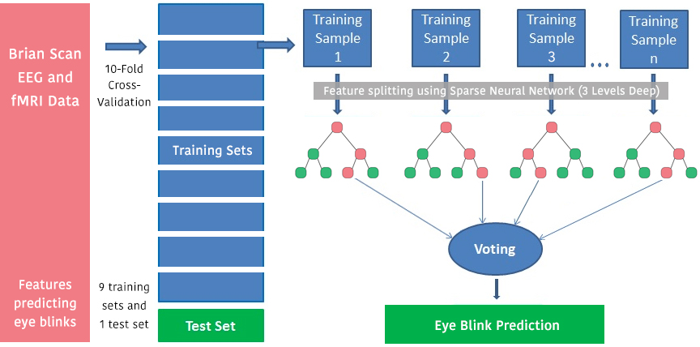

[RealityStream Models](../)

# Random Bits Forest (RBF)

Predicting eye blinks. Hyperparameter Tuning identifies which brain voxels are the best predictors for blinks. In the [target "y" column](https://github.com/ModelEarth/RealityStream/blob/main/models/random-bits-forest/blinks-input.csv), a 1 indicates a blink.

Testing accuracy of 93% after tuning, from 88% with default parameters before tuning.

Most important feature was X7, the least important was X9.

Init virtual environment in RealityStream

	python3 -m venv env &&
	source env/bin/activate &&
	pip install numpy &&
	pip install pandas &&
	pip install scikit-learn

Run locally:

	python rbf.py blinks

[View Blinks Output](../../output/blinks/)

## Sparse Neural Network (with only 3 layers) 

 Random Bits Forest (RBF) performed better than seven other methods, including Nearest Neighbor regression.  

  

### Random Bits Forest ML with tuning by Neural Network Deep Learning 

In 2016 Yi Wang further improved predications of eye blinks using the UC Irvine EEG dataset by preceding the random forest training with feature selection (tuning) using gradient boosting with a sparse neural network (with only 3 layers) to make decision tree splits that were less linear than random forest alone.

Wang, Y., Li, Y., Pu, W., Wen, K., Shugart, Y. Y., Xiong, M., & Jin, L. (2016). Random bits forest: a strong classifier/regressor for big data. Scientific reports, 6, 30086.

RBF Combines Machine Learning with sparse Neural Network (3 levels deep) [Paper](https://www.nature.com/articles/srep30086.pdf) | [Executable](http://sourceforge.net/projects/random-bits-forest/)

<!-- dscape/lab/brain -->

[EEG Eye State](https://archive.ics.uci.edu/ml/datasets/EEG+Eye+State)

[The Classification of Eye State](https://www.researchgate.net/profile/Kadir-Sabanci/publication/289685013_The_Classification_of_Eye_State_by_Using_kNN_and_MLP_Classification_Models_According_to_the_EEG_Signals/links/5aa992f5aca272d39cd5dde4/The-Classification-of-Eye-State-by-Using-kNN-and-MLP-Classification-Models-According-to-the-EEG-Signals.pdf) by Using kNN and MLP ClassificationModels According to the EEG Signals 