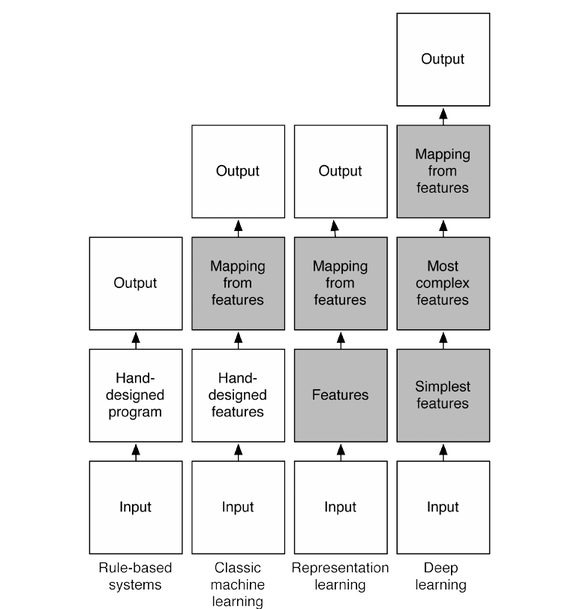

## Brain Voxels

### The highest resolution brain scans contain 1.2 million voxels.

Each voxel is about 1 cubic millimeter and the average brain is 1,200,000 cubic millimeters.

A voxel is a summary of a brain regions intensity for 1 second.  

Each voxel in the cerebral cortical contains 630,000 neurons, and over 2 million glial cells.  

Sources: [What is a Voxel](https://blogs.scientificamerican.com/observations/whats-a-voxel-and-what-can-it-tell-us-a-primer-on-fmri/)

## Deep Learning - A subset of Machine Learning

Both forms of artificial intelligence algorithms contrast with Rule-Based Systems where decisions are manually programmed.  

<b>Machine Learning</b> is the process of using algorithms to parse sets of data (training sets) using pre-defined attributes (features) to predict other sets of data. 

<b>Deep Learning</b> is used in layers to create an <b>Artificial Neural Network</b> inspired by the biological neural network of the human brain. “Deep Learning” extracts undefined attributes (features) from raw data (like image pixels or sin waves in audio). 

PyTorch and Google JAX are more flexible than Keras. [Keras is training wheels](https://keras.io/): The Python Deep Learning library - TensorFlow Simplified. Keras is now available for JAX, TensorFlow, and PyTorch. TensorFlow could get replaced by JAX.

<b>Both ML and DL have supervised and unsupervised versions</b>
<a href="https://towardsdatascience.com/machine-learning-vs-deep-learning-62137a1c9842">source</a>  

"Supervised learning involves an output label associated with each instance in the dataset. This output can be discrete/categorical or real-valued. Regression models estimate real-valued outputs, whereas classification models estimate discrete-valued outputs.   Simple binary classification models have just two output labels, 1 (positive) and 0 (negative).  Popular supervised learning ML algorithms are linear regression, logistic regression, decision trees, support vector machines, and neural networks, as well as non-parametric models such as k-Nearest Neighbors."  

"Unsupervised learning, algorithms such as k-Means, hierarchical clustering, and Gaussian mixture models attempt to learn meaningful structures in the data."

<b>Generative Adversial Networks (GAN)</b> are a form of deep learning in which one side of the network estimates if the other side is correct.  

   

## fMRI Recognizing Speech (2016) and ML Speaking that Speech (2019) 

[Natural speech reveals the semantic maps that tile human cerebral cortex](https://www.nature.com/articles/nature17637) - 2016 ([nice graphics](https://media.nature.com/lw926/nature-assets/nature/journal/v532/n7600/images/nature17637-f2.jpg))

[Synthetic speech generated from brain recordings](https://www.sciencedaily.com/releases/2019/04/190424153558.htm) - 2019 ([audio](https://www.ucsf.edu/news/2019/04/414296/synthetic-speech-generated-brain-recordings))   
  

## EEG eye state dataset

[http://archive.ics.uci.edu/ml/datasets/EEG+Eye+State](http://archive.ics.uci.edu/ml/datasets/EEG+Eye+State)  

## ML applied to Eye Blink Data

### k-nearest neighbors algorithm

[The Classification of Eye State by Using kNN and MLP ClassificationModels According to the EEG Signals](https://www.researchgate.net/profile/Kadir_Sabanci3/publication/289685013_The_Classification_of_Eye_State_by_Using_kNN_and_MLP_Classification_Models_According_to_the_EEG_Signals/links/5aa992f5aca272d39cd5dde4/The-Classification-of-Eye-State-by-Using-kNN-and-MLP-Classification-Models-According-to-the-EEG-Signals.pdf)

## ML Apps and Databases

[DIY Neural Network in Python](https://towardsdatascience.com/how-to-build-your-own-neural-network-from-scratch-in-python-68998a08e4f6)  

[Azure ML Studio](https://studio.azureml.net/) and now [Azure ML Designer](https://docs.microsoft.com/en-us/azure/machine-learning/concept-designer) - and/or [Spark DataBricks](https://databricks.com/) for large datasets  

<!--
## Which studies use both voxels and brain waves?
-->